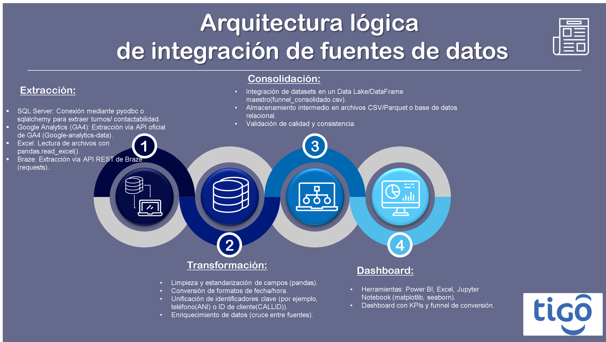

# **Prueba Técnica - Caso de Negocio**
## Prueba Analítica: Especialista BI para Marketing 
### Especialista BI:

* Daniel Felipe Pérez Grajales . dfperezg@unal.edu.co<br>

<br><br>


---
<br>

**Objetivo General:**

Evaluar la capacidad del aspirante al cargo *Especialista BI para Marketing* para:

1.	Integrar múltiples fuentes de datos, diseñando una arquitectura eficiente de unificación de fuentes.
2.	Uso de SQL para extraer, organizar y analizar información
3.	Construir el funel de conversión completo a partir de bases N1 y N2 realizar análisis profundos. El candidato deberá implementar un proceso de ETL en Python como parte clave de la solución.
4.	Desarrollar visualizaciones gerenciales e identificar cuál estrategia de contacto es más efectiva. 


**Contexto:**

Tigo Colombia ejecuta campañas multicanal para contactar prospectos y clientes a través de *Call Center*, *Email* y *SMS*. Cada canal tiene sus propias fuentes y características operativas. Con el fin de mejorar la eficiencia de estas estrategias, es necesario analizar el desempeño completo del *funnel de conversión*, desde el primer contacto (N1) hasta la acción final (N2) de un Emtelco, uno de los canales de venta.

**Parte 1: Diseño de arquitectura de datos**

Se simularán diferentes orígenes de datos para el ejercicio, como:

*	**SQL Server:** Turnos de atención/contactabilidad del Call Center.<br>
*	**Google Analytics (GA4):** Datos de comportamiento digital y e-commerce.<br>
*	**Excel:** Seguimiento manual de campañas.<br>
*	**Braze:** Registro de contactos y respuestas vía WhatsApp/email/SMS.<br>


**Actividades esperadas del candidato**

*	Diseñar una arquitectura lógica que permita integrar las fuentes de datos mencionadas.
*	Definir herramientas de extracción, transformación y consolidación.
*	Representar visualmente la arquitectura (puede ser en pptx, Miro, Notion, etc.).
<br>
<br>



<br>

**Parte 2 – Análisis funnel de conversión**

**Entregables:**

*	Script Python con la ETL y documentación (`Prueba_Tecnica_Especialista_BI.ipynb`,`etl_contactabilidad.py`).
*	Dataset final consolidado y limpio (`funnel_consolidado.csv`).
*	Dashboard o visualización con análisis (`Informe_analisis_funnel_de_conversion.pbix`).
*	Informe ejecutivo o presentación con análisis y recomendaciones (`reporte_gerencial.pptx`).


**Parte 3 – Uso SQL**

Para esta sección no es necesaria hacer presentación. **Solamente se requiere enviar su solución. Los datos en las tablas descritas a continuación, son de “libre creación”.**
Evaluación SQL (Estándar)

Sean las siguientes tablas de una base de datos de una corredora de propiedades:
1.	Arrendatario (RUT, Nombre, Apellido)
2.	Arrienda (RUT, Id_casa,Deuda) Ojo: Deuda >=0 (si es 0, no hay deuda)
3.	Teléfonos (RUT, Telefono)
4.	Dueño (RUT, Nombre, Apellido)
5.	Casa (Id_casa, RUT, Nro,Calle, Comuna)<br>

```sql
CREATE TABLE Arrendatario (
    RUT VARCHAR(20) PRIMARY KEY,
    Nombre VARCHAR(100) NOT NULL,
    Apellido VARCHAR(100) NOT NULL
);

CREATE TABLE Dueño (
    RUT VARCHAR(20) PRIMARY KEY,
    Nombre VARCHAR(100) NOT NULL,
    Apellido VARCHAR(100) NOT NULL
);

CREATE TABLE Casa (
    Id_casa INT PRIMARY KEY,
    RUT VARCHAR(20) NOT NULL,
    Nro VARCHAR(10) NOT NULL,
    Calle VARCHAR(100) NOT NULL,
    Comuna VARCHAR(100) NOT NULL,
    FOREIGN KEY (RUT) REFERENCES Dueño(RUT)
);

CREATE TABLE Arrienda (
    RUT VARCHAR(20) NOT NULL,
    Id_casa INT NOT NULL,
    Deuda DECIMAL(12,2) NOT NULL CHECK (Deuda >= 0),
    PRIMARY KEY (RUT, Id_casa),
    FOREIGN KEY (RUT) REFERENCES Arrendatario(RUT),
    FOREIGN KEY (Id_casa) REFERENCES Casa(Id_casa)
);

CREATE TABLE Telefonos (
    RUT VARCHAR(20) NOT NULL,
    Telefono VARCHAR(20) NOT NULL,
    PRIMARY KEY (RUT, Telefono),
    FOREIGN KEY (RUT) REFERENCES Arrendatario(RUT)
);
```
Al respecto, conteste las siguientes preguntas construyendo las sentencias SQL que corresponda:<br>

1.	Los arrendatarios que arriendan la casa ubicada en la calle Carrera nº 1024, Santiago.

```sql
SELECT a.RUT, a.Nombre, a.Apellido
FROM Arrendatario a
JOIN Arrienda ar ON a.RUT = ar.RUT
JOIN Casa c ON ar.Id_casa = c.Id_casa
WHERE c.Calle = 'Carrera' AND c.Nro = 1024 AND c.Comuna = 'Santiago';
```

2.	¿Cuánto le deben a María Pérez?


```sql
SELECT SUM(ar.Deuda) AS Total_Deuda
FROM Dueño d
JOIN Casa c ON d.RUT = c.RUT
JOIN Arrienda ar ON c.Id_casa = ar.Id_casa
WHERE d.Nombre = 'María' AND d.Apellido = 'Pérez';
```
3.	¿Cuál es la deuda total para cada dueño?

```sql
SELECT d.RUT, d.Nombre, d.Apellido, SUM(ar.Deuda) AS Total_Deuda
FROM Dueño d
JOIN Casa c ON d.RUT = c.RUT
JOIN Arrienda ar ON c.Id_casa = ar.Id_casa
GROUP BY d.RUT, d.Nombre, d.Apellido;
```
4.	Liste todas las personas de la base de datos

```sql
SELECT RUT, Nombre, Apellido FROM Arrendatario
UNION
SELECT RUT, Nombre, Apellido FROM Dueño;
```

5.	Indique los dueños que poseen tres o más casas.

```sql
SELECT d.RUT, d.Nombre, d.Apellido, COUNT(c.Id_casa) AS Cantidad_Casas
FROM Dueño d
JOIN Casa c ON d.RUT = c.RUT
GROUP BY d.RUT, d.Nombre, d.Apellido
HAVING COUNT(c.Id_casa) >= 3;
```

6.	Liste los dueños que tengan deudores en todas sus casas.

```sql
SELECT d.RUT, d.Nombre, d.Apellido
FROM Dueño d
JOIN Casa c ON d.RUT = c.RUT
LEFT JOIN Arrienda ar ON c.Id_casa = ar.Id_casa
GROUP BY d.RUT, d.Nombre, d.Apellido
HAVING SUM(CASE WHEN ar.Deuda = 0 OR ar.Deuda IS NULL THEN 1 ELSE 0 END) = 0;
```

7.	Entregue estadísticas sobre los arrendatarios por casa. Entregue:
•	El promedio
•	La varianza
•	El máximo
•	El mínimo.
•	La moda.
•	La mediana.

```sql
SELECT
    c.Id_casa,
    COUNT(ar.RUT) AS cantidad_arrendatarios,
    AVG(ar.Deuda) AS promedio_deuda,
    VARIANCE(ar.Deuda) AS varianza_deuda,
    MAX(ar.Deuda) AS max_deuda,
    MIN(ar.Deuda) AS min_deuda,
    -- Moda: valor más frecuente de la deuda
    (SELECT ar2.Deuda
     FROM Arrienda ar2
     WHERE ar2.Id_casa = c.Id_casa
     GROUP BY ar2.Deuda
     ORDER BY COUNT(*) DESC
     LIMIT 1) AS moda_deuda,
    -- Mediana: valor central de la deuda
    (SELECT AVG(sub.Deuda) FROM (
            SELECT ar3.Deuda
            FROM Arrienda ar3
            WHERE ar3.Id_casa = c.Id_casa
            ORDER BY ar3.Deuda
            LIMIT 2 - (SELECT COUNT(*) FROM Arrienda ar4 WHERE ar4.Id_casa = c.Id_casa) % 2
            OFFSET (SELECT (COUNT(*) - 1) / 2 FROM Arrienda ar5 WHERE ar5.Id_casa = c.Id_casa)
    ) sub) AS mediana_deuda
FROM Casa c
LEFT JOIN Arrienda ar ON c.Id_casa = ar.Id_casa
GROUP BY c.Id_casa;
```

#### **Evaluación PL/SQL (Oracle)**

### 1.	Explique la función NVL. ¿Es mejor usar un NVL que un Case When? Explique su respuesta.

 La función `NVL(expr1, expr2)` en Oracle retorna `expr2` si `expr1` es `NULL`; de lo contrario, retorna `expr1`. Es útil para reemplazar valores nulos por un valor por defecto.  

 **¿Es mejor usar NVL que un CASE WHEN?**  

 Para reemplazar nulos, `NVL` es más simple y legible que `CASE WHEN expr IS NULL THEN ... ELSE ... END`. Sin embargo, `CASE WHEN` es más flexible para condiciones complejas. Si solo necesitas reemplazar nulos, `NVL` es preferible por claridad y rendimiento.


### 2.	Explique la función Left Join. En que casos es mas relevante usar un Left Join, en vez de un Inner Join.

**Función LEFT JOIN**  

Un `LEFT JOIN` retorna todas las filas de la tabla izquierda y las filas coincidentes de la tabla derecha. Si no hay coincidencia, los valores de la tabla derecha serán `NULL`.  

 **¿Cuándo usar LEFT JOIN en vez de INNER JOIN?**  

 Usa `LEFT JOIN` cuando necesitas conservar todas las filas de la tabla izquierda, incluso si no hay coincidencia en la tabla derecha. Por ejemplo, para listar todos los clientes y sus pedidos (si existen), mostrando clientes sin pedidos.


### 3.	Explique la función row_number() Over (Partition by … Order by…). Danos un ejemplo en el cual es funcional esta función.

**Función ROW_NUMBER() OVER (PARTITION BY ... ORDER BY ...)**  
    Asigna un número secuencial a cada fila dentro de un grupo definido por `PARTITION BY`, ordenado por `ORDER BY`.  
    **Ejemplo funcional:**  
    Obtener el pedido más reciente por cliente:

    ```sql
    SELECT *
    FROM (
      SELECT
         cliente_id,
         pedido_id,
         fecha_pedido,
         ROW_NUMBER() OVER (PARTITION BY cliente_id ORDER BY fecha_pedido DESC) AS rn
      FROM pedidos
    ) t
    WHERE rn = 1;
    ```

    Así obtienes el último pedido de cada cliente.

### 4.	Explique que es un Cursor y cuando son Implícitos y Explícitos

**Cursor**  
    Un cursor es un mecanismo para recorrer fila por fila el resultado de una consulta en bases de datos.  
    - **Implícitos:** Se gestionan automáticamente, por ejemplo, en sentencias `SELECT INTO` o `UPDATE`.
    - **Explícitos:** El programador los declara y controla (abrir, recorrer, cerrar), útiles para procesar resultados fila a fila en PL/SQL.


### 5.	¿Crees que desde Oracle puedes crear una ETL y que sea funcional? Justifica tu respuesta

Sí, Oracle permite crear procesos ETL usando PL/SQL, procedimientos almacenados, funciones, triggers y herramientas como Oracle Data Integrator. Puedes extraer datos, transformarlos y cargarlos en tablas destino, automatizando procesos complejos y asegurando integridad y rendimiento.
